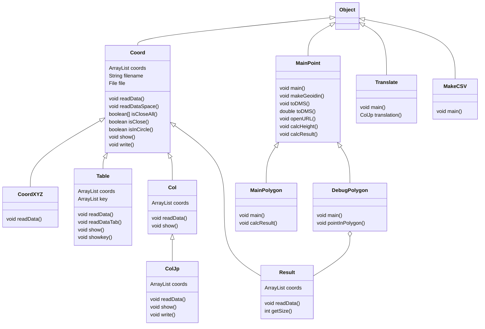

## README

自分用です。

## 概要

- 研究でデータ収集や分析など自動化するためのツール。
- 基本的に自分用なのでクラスやメソッドの整理だけです。

- コードは煩雑ですが、自分が使えればいいやスタンスで作ったので修正する予定はないです。
  説明も碌に入れてないので作成者以外は多分使えません。

## 機能

1. MainPoint
   - 対象の地物が事故現場の周囲に存在するかを計算する
   - 途中で国土地理院の外部サービスを使ってる
2. MainPolygon
   - 事故現場の座標と同じ地物が存在するか確認する。
3. DebugPolygon
   - ブール配列がtrueのものだけ座標を書き出す。
4. Translate
   - excelを日本語化するように言われたので、対応表をもとに列ごとに日本語化したデータをファイル出力。
5. MakeCSV
   - 列データをくっつけてCSVにする。

## クラス図

そのまま継承してるメソッドとフィールドは省略

